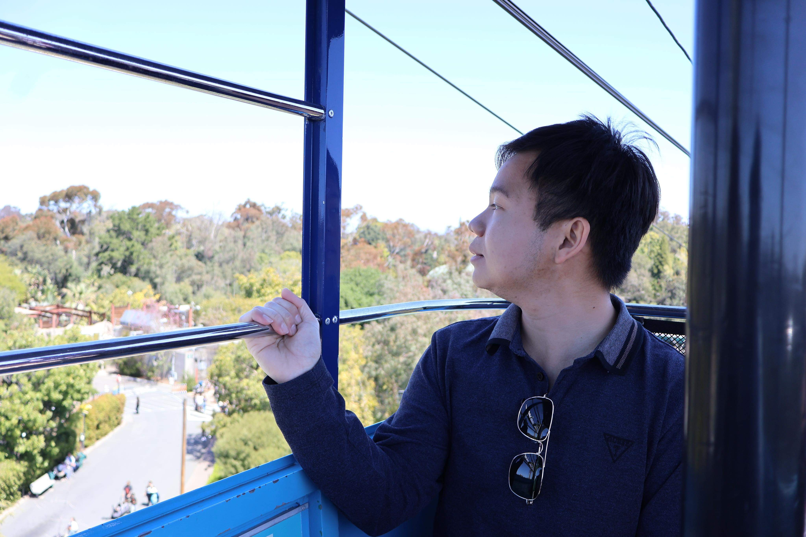

# Welcome to my webpage!



My name is Samvathna Em. I'm currently studying _Computer Science_ at UCSD. <br>
This is a field I am very passionate about, and I am eager to learn, challenge, and grow in it.<br>

Greetings from my corner of the internet! Since Java is my most programming language, I'd like to greet you in the way I am most comfortable - with code. Here's a simple Hello program that captures my excitement:

```java
public class Hello{

    public static void main(String[] args)
    {
        System.out.println("Welcome to my webpage!");
    }
}
```
## Here's an outline of my webpage: <br>
(You can access these sections directly)<br>
- [A brief introduction about me](#some-information-about-myself)
- [My Academic Journey](#my-academic-journey)
- [Skills and Fun Stuff](#skills-and-fun-stuff)
- [My goals](#my-goals)

## Some information about myself

Even though I haven't had much experience in the tech world yet, I'm excited to learn more about software, machine learning, and app development at UCSD.


## My Academic Journey

Studying at the University of California, San Diego has been a blast so far! <br>
Here’s what I’ve been up to:<br>
1. Graduated from high school in Cambodia
2. Graduated from San Diego Community College with an associate's degree
3. Attended UCSD as a transfer student


## Skills and Fun Stuff
- Learning the basics of coding in Java, C++, and Python at San Diego Community College
- Working on few major project assignments, here they are:
  + Card game in Java: 
    * Please feel free to view my project [Github Pages](https://github.com/SamvathnaEm/CSE282Project)
  + Huffman coding/data compression project in C++: 
    * Please feel free to view my project [Github Pages](https://github.com/SamvathnaEm/CSE100Project1)
- During my leisure, I love to:
  + Watch horror movies
  + Playing a bunch of video games
    * Here are my most favorite games: 
      * Please check them out [here](favoritegames.md)
  + Hanging out with my friends 


## My Goals
- [x] Get an associate degree in Computer Science
- [ ] Build my first web application
- [ ] Find an internship by the end of 2025
- [ ] Travel to Japan

<br>
Lastly, here's my most inspiring quote that I would like to share.

> Optimism is the faith that leads to achievement. Nothing can be done without _**Hope and Confidence**_. - Helen Keller. 


